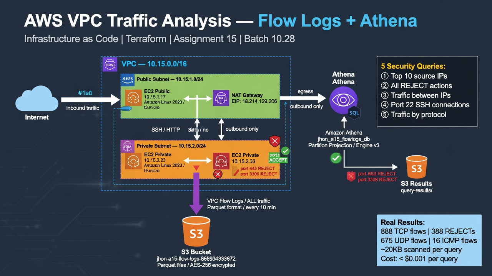

# 🔍 AWS VPC Traffic Analysis — Flow Logs + Athena

Infraestructura como código (Terraform) para capturar y analizar tráfico de red en AWS usando VPC Flow Logs en formato Parquet y Amazon Athena para consultas SQL.

## 📋 ¿Qué hace este proyecto?

Despliega una VPC completa con dos instancias EC2 (pública y privada), habilita VPC Flow Logs en formato Parquet hacia S3, y crea una tabla de Athena con partition projection para analizar el tráfico mediante SQL — sin servidores, sin pipelines de datos, pagando solo por lo que se escanea.

## 🏗️ Arquitectura


```

## 📁 Estructura del proyecto

```
aws-vpc-traffic-analysis-flowlogs-athena/
├── terraform/
│   ├── main.tf           # Recursos AWS: VPC, EC2, S3, Flow Log, Athena
│   ├── variables.tf      # Parámetros configurables
│   └── outputs.tf        # IPs, bucket names, comandos SSH
├── queries/
│   ├── flow_logs_analysis.sql   # 5 queries de análisis de seguridad
│   └── traffic_generator.sh    # Script para generar tráfico en EC2
└── docs/
└── architecture.png
```

## ⚡ Recursos desplegados

| Recurso | Descripción |
|---|---|
| VPC | Red privada 10.15.0.0/16 con DNS habilitado |
| Subnet pública | 10.15.1.0/24 — EC2 con IP pública |
| Subnet privada | 10.15.2.0/24 — EC2 sin IP pública |
| Internet Gateway | Acceso bidireccional a internet |
| NAT Gateway | Salida a internet para subnet privada |
| EC2 x2 | Amazon Linux 2023, t3.micro |
| S3 (flow logs) | Almacenamiento Parquet encriptado AES-256 |
| S3 (athena results) | Resultados de queries |
| VPC Flow Log | Captura ALL (ACCEPT + REJECT) en Parquet |
| Athena Database | `jhon_a15_flowlogs_db` con partition projection |
| Athena Workgroup | Configurado con output S3 |
| 7 Saved Queries | DDL + 5 análisis de seguridad |

## 🔍 Queries de análisis incluidas

```sql
-- 1. Top 10 IPs por volumen de tráfico
SELECT srcaddr, COUNT(*), SUM(bytes) FROM vpc_flow_logs
GROUP BY srcaddr ORDER BY SUM(bytes) DESC LIMIT 10;

-- 2. Todos los REJECTs (intentos bloqueados)
SELECT from_unixtime(start), srcaddr, dstport, action
FROM vpc_flow_logs WHERE action = 'REJECT';

-- 3. Tráfico entre IPs específicas (bidireccional)
SELECT * FROM vpc_flow_logs
WHERE (srcaddr = 'X' AND dstaddr = 'Y') OR (srcaddr = 'Y' AND dstaddr = 'X');

-- 4. Conexiones SSH al puerto 22
SELECT srcaddr, action, tcp_flags FROM vpc_flow_logs WHERE dstport = 22;

-- 5. Tráfico por protocolo (TCP/UDP/ICMP)
SELECT protocol, COUNT(*), SUM(bytes) FROM vpc_flow_logs GROUP BY protocol;
```

## 🚀 Despliegue

### Prerequisitos
- Terraform >= 1.3
- AWS CLI configurado (`aws configure`)
- SSH key pair generado

### Pasos

```bash
# 1. Clonar el repo
git clone https://github.com/TU_USUARIO/aws-vpc-traffic-analysis-flowlogs-athena.git
cd aws-vpc-traffic-analysis-flowlogs-athena/terraform

# 2. Crear terraform.tfvars con tu SSH key (NO subir al repo)
echo 'public_key_material = "'$(cat ~/.ssh/id_ed25519.pub)'"' > terraform.tfvars

# 3. Inicializar y aplicar
terraform init
terraform apply -auto-approve

# 4. Ver outputs (IPs, comandos SSH, buckets)
terraform output
```

### Generar tráfico de prueba

```bash
# SSH al EC2 público
ssh -i ~/.ssh/id_ed25519 ec2-user@$(terraform output -raw public_ec2_public_ip)

# Desde el EC2 público:
ping -c 20 <private_ip>              # genera flows ICMP
wget -q -O /dev/null https://amazon.com  # genera flows TCP/HTTPS
nc -zv <private_ip> 443              # genera flows REJECT
```

### Verificar logs en S3 (esperar ~10 min)

```bash
aws s3 ls s3://$(terraform output -raw flow_logs_s3_bucket)/AWSLogs/ --recursive | head -5
```

## 🔎 Configurar Athena

1. Abrir Athena Console → workgroup `primary`
2. Settings → Query result location → `s3://<athena-results-bucket>/query-results/`
3. Correr el DDL de `queries/flow_logs_analysis.sql`
4. Correr las 5 queries de análisis

> **Nota:** El campo `end` es palabra reservada en SQL — usar backticks: `` `end` ``

## 💡 Decisiones de diseño

**¿Por qué Parquet y no CSV?**
Parquet es columnar — Athena solo lee las columnas que pides. Resultado: ~80% menos datos escaneados = ~80% menos costo. Cada query en este lab escaneó ~20KB.

**¿Por qué Partition Projection?**
Elimina la necesidad de correr `MSCK REPAIR TABLE` cada vez que llegan nuevos logs. Athena infiere automáticamente los paths de partición desde el S3 location.

**¿Por qué bastion host pattern?**
El EC2 privado no tiene IP pública — solo se accede via jump desde el EC2 público. Minimiza la superficie de ataque: un solo punto de entrada SSH al entorno.

## ⚠️ Cleanup

```bash
terraform destroy -auto-approve
```

> El NAT Gateway acumula $0.045/hora. Destruir el entorno al terminar el lab.

## 📊 Costos estimados (lab)

| Recurso | Costo estimado (lab ~4hr) |
|---|---|
| NAT Gateway | ~$0.18 |
| EC2 x2 t3.micro | ~$0.08 |
| S3 almacenamiento | < $0.001 |
| Athena queries | < $0.001 |
| **Total** | **~$0.26** |

## 🏷️ Tags

Todos los recursos tienen tags:
- `Project`: Assignment-15
- `ManagedBy`: Terraform
- `Student`: Hector-Jonathan-Maldonado-Vega
- `Batch`: 10.28
